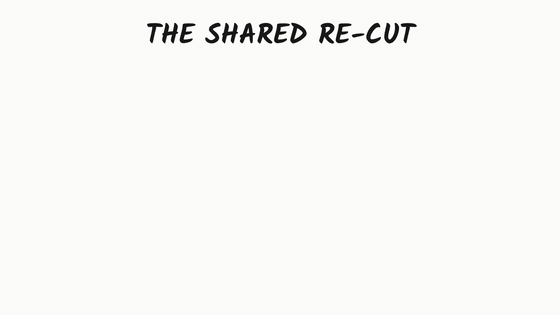
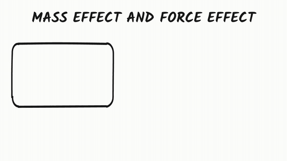
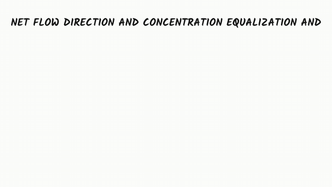
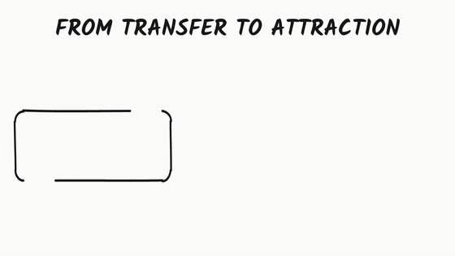
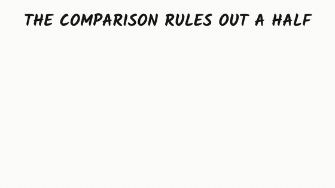
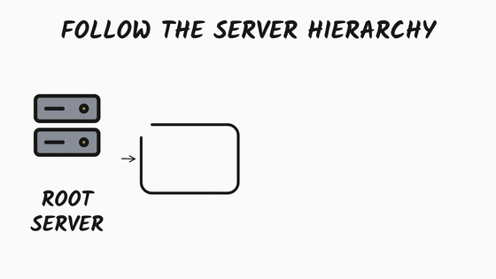
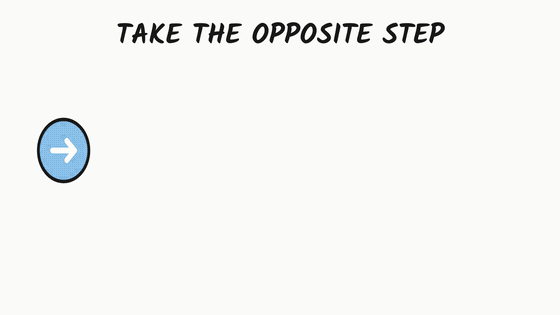
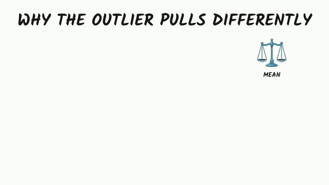

# Lamina Labs Clone — archived research (draft, not achieved)

A one-month attempt to reproduce the look of narrated, hand-drawn whiteboard explainer videos (Simi / Lamina Labs) with a deterministic, source-grounded TypeScript pipeline. **Status: archived draft. The target quality was not reached; work continues in a new Python implementation using a different method.**

## Results (generated by this pipeline)

60–80 s lessons, first 14 s of each shown. Each is a full automated run (about $0.02, 3–4 min cold). Every run is graded `draft`; none `passed`.

| | | |
|---|---|---|
|  |  |  |
|  |  |  |
|  |  | |

## What we observed

- The pipeline ran end to end: 8 of 8 benchmark lessons produced narrated MP4s with 0 hard failures.
- The boards stayed **box-and-label heavy**. Reference videos are illustrated scenes (plant, sun, cloud, person) drawn one icon per narration beat. Ours are text pills and a few small icons.
- Typed SVG plus a retrieved icon library cannot supply a fitting picture for abstract concepts. Where no icon matched, the system fell back to a labelled box.
- Layout and text defects remained: titles overflowing the frame, empty boxes visible mid-reveal, 7 of 8 videos shorter than requested.
- The frozen Simi benchmark scorer failed 8 of 8 (contract gaps, not a pass). The experimental V2 board-ops path produced no accepted output.
- Reliability was weak on cold runs: most recorded attempts across all trees ended in a failed state (planner/validator repair loops, provider limits).
- A warm-cache replay was faster (57 s vs 180 s) but did not reproduce the same output.

## What we lacked

- A generative source of illustrations. We tried to build pictures from a fixed catalog; the reference style depends on an image model drawing a whole scene.
- Fundamental detail on how the reference reveals strokes (outline then fill, arrow before target) and on its scene composition, so we approximated from frames only.
- Measured parity: no run was ever compared to the reference with a valid protocol.

## Why we switched

Early tests of an alternative method — image-model illustrated scenes revealed with a stroke-by-stroke animation engine, plus region-to-narration timing — produced boards much closer to the reference look in minutes of CPU rendering. Those tests used substitute scenes; the full method is not yet validated. A new Python repository carries it forward. This repository is kept as the record of what did not work and why.

## Repository map

| Path | One-liner |
|---|---|
| `src/` | TypeScript pipeline: stages, planner, resolver, renderer, gates |
| `src/assets/` | Icon catalog loading and concept-to-icon resolution |
| `src/visual-v2/` | Experimental board-ops path; produced no accepted output |
| `bench/` | Frozen benchmark definitions and run harness |
| `harness/` | Validation harness, reference observations, reports |
| `voice-engine/` | Local text-to-speech service wrapper |
| `rag-engine/`, `parse-engine/` | Source ingestion helpers |
| `scripts/` | CLI utilities (contact sheets, benchmarks, reviews) |
| `config/`, `skills/` | Runtime configuration and agent skill packs |
| `docs/results/` | GIF samples shown above |
| `docs/` | Handoffs, architecture, audits (`BRANCH-HANDOFF.md` is the latest) |

## Tags

`stcc-charter-v1`, `stcc-charter-v1-final`: final state. `v0.01 … v1.0.0`: earlier milestones. `archive/*`: former branches kept as tags.

## Licensing note

Third-party icon sets and reference imagery appear in this repository's history. They remain under their own licences and are not offered for reuse.
