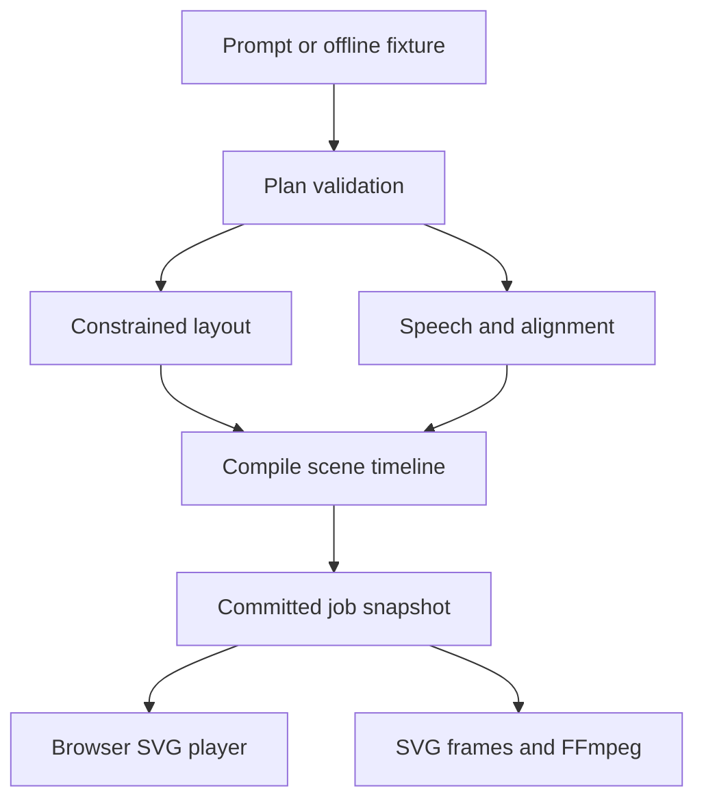

# Architecture and decisions

## Data-driven rendering

The model emits an explanation plan. A whitelist validator accepts only known fields. A compiler resolves a small set of semantic layouts into geometry, connects node boundaries and schedules reveals against word positions. A pure SVG renderer reconstructs any frame from `(compiledScene, timeMs)`.

The whiteboard is implemented with inline SVG in v0.1, not an HTML Canvas 2D surface. Both are viable implementations of the user's canvas concept. SVG was selected here so the browser and offline rasterizer consume the exact same graphical representation. This avoids maintaining two renderers before the hypothesis is established.

## Module map

| Module | Responsibility |
|---|---|
| `src/engine.ts` | Whitelist validation, timing estimate, three layouts, pure scene state, SVG rendering, playback clamp. |
| `src/fixtures.js` | Hand-authored attention and photosynthesis examples. Never described as model output. |
| `src/providers.ts` | ElevenLabs audio/alignment; OpenRouter chapter generation lives in planner.ts. Errors remain visible. |
| `src/jobs.ts` | Single-process async preparation, atomic JSON snapshots, monotonic availability, cancellation. |
| `src/server.ts` | Loopback HTTP app, job API, local media and static files. |
| `public/app.ts` | Polling, play/pause/seek, audio clock integration, transcript and experiment metrics. |
| `scripts/export.ts` | Render explicit frame times through SVG/Sharp; encode with FFmpeg; optionally mux per-scene narration. |

## Plan versus compiled scene

The plan holds `version`, `title`, and scenes. Each scene has `id`, `title`, `narration`, `layout`, nodes with labels and zero-based whitespace word indices, connectors and an optional note. The model cannot inject executable source, URLs, arbitrary SVG or style attributes.

Compilation produces node rectangles, line endpoints, draw durations, resolved times and word alignment. Logical size is 1280×720; the browser scales the viewBox and export rasterizes at a selected resolution. Aspect-ratio reflow is not implemented.

Geometry is fixed for a committed scene. Revealing a later node never reflows an already visible node. Connectors start after both endpoint nodes have appeared. A 650 ms scene tail protects the final event from immediate replacement.

## Timing and audio

Offline mode estimates 145 words/minute. It is silent, displays the narration as timed text and marks timing as estimated. It does not claim speech synthesis.

With keys, the speech provider returns MP3 bytes and character timestamps. The adapter verifies source text agreement and maps characters to indexed words. Normalization mismatches fail visibly rather than silently drifting. The player uses the audio clock while speech is active, and advances through the scene tail afterward. Browser autoplay, seek and pause behavior still require live browser QA.

The MP4 exporter uses the same time-based renderer. Narrated exports pad/trim each scene's audio to its compiled duration before concatenation. Export the original job JSON beside its MP3 files; a downloaded JSON alone does not contain audio bytes.

## Progressive delivery

Job states: queued → planning → preparing → complete, with error/cancelled alternatives. A restarted server reports a persisted unfinished job as interrupted. It preserves prepared scenes but does not resume an interrupted model request.

The browser polls full snapshots every 400 ms. Each snapshot has a revision and bounded sequence of events. Full snapshots make read reconnection simple and idempotent. Scene preparation is sequential in a background async task; browser playback proceeds independently. There is no HLS, SSE, multi-process queue, or scene-parallel generation in v0.1.

User-selected delay is injected per scene to exercise buffering. It must not be counted as actual model generation speed. During starvation the clock clamps to prepared duration. Completion and buffering are distinct states.

## Local runtime boundary

Use Node 22+ and TypeScript; npm run build emits ESM modules into dist. The server binds to loopback, limits two active jobs, denies cross-origin writes, caps request size, and serves only explicit source modules and local public/media paths.

This is not a production multi-user service. Job snapshots remain in memory after completion and are retained on disk. Add retention, authentication and a real worker process only when needed for deployment. Provider output validation establishes structural safety, not factual correctness.

## Explicitly deferred

- Fine-tuning and any foundation-model training.
- Arbitrary generated code or Manim execution.
- Automatic model repair loops and scene-parallel generation.
- Pixel-accurate text measurement, multilingual font packaging, advanced routing.
- HLS, persistent distributed queues and automatic restart recovery.
- External image assets, background music, PDF extraction and source citation verification.
- Production latency/cost claims and open-domain quality claims.

## Local narration update (2026-09-08)

`src/local-speech.ts` launches the fixed `scripts/robot_tts.py` helper with JSON
on stdin. Narration is data, never generated executable code. Python invokes
macOS say (Alex) per word, trims PCM silence, adds a fixed short gap and records
boundaries using sample counts. WAV media uses the same player and export
timeline as ElevenLabs MP3. This mode is labeled local-segment-aligned and has
robotic cadence. It requires Python 3 and macOS speech access, not FFmpeg.
ElevenLabs uses per-job voiceId or its configured default. TTS errors fail
visibly; there is no automatic silent fallback.

Browser media is the master clock during speech, with a separate visual tail.
Seeking resets audio identity; seeking into the tail does not replay narration.
A generation counter ignores stale play-promise updates. Preparation events
are persisted in snapshots and shown in the UI. `/?job=UUID` opens a saved job.

### ElevenLabs default

Following the user's voice-quality feedback, omitted ttsProvider now selects
ElevenLabs; local Python speech requires explicit selection. The ignored .env
uses the successfully tested premade Alice voice. Speech failures preserve the
provider HTTP status/code/message. Library-plan restrictions must not be labeled
as exhausted quota. The UI defaults match the API.
