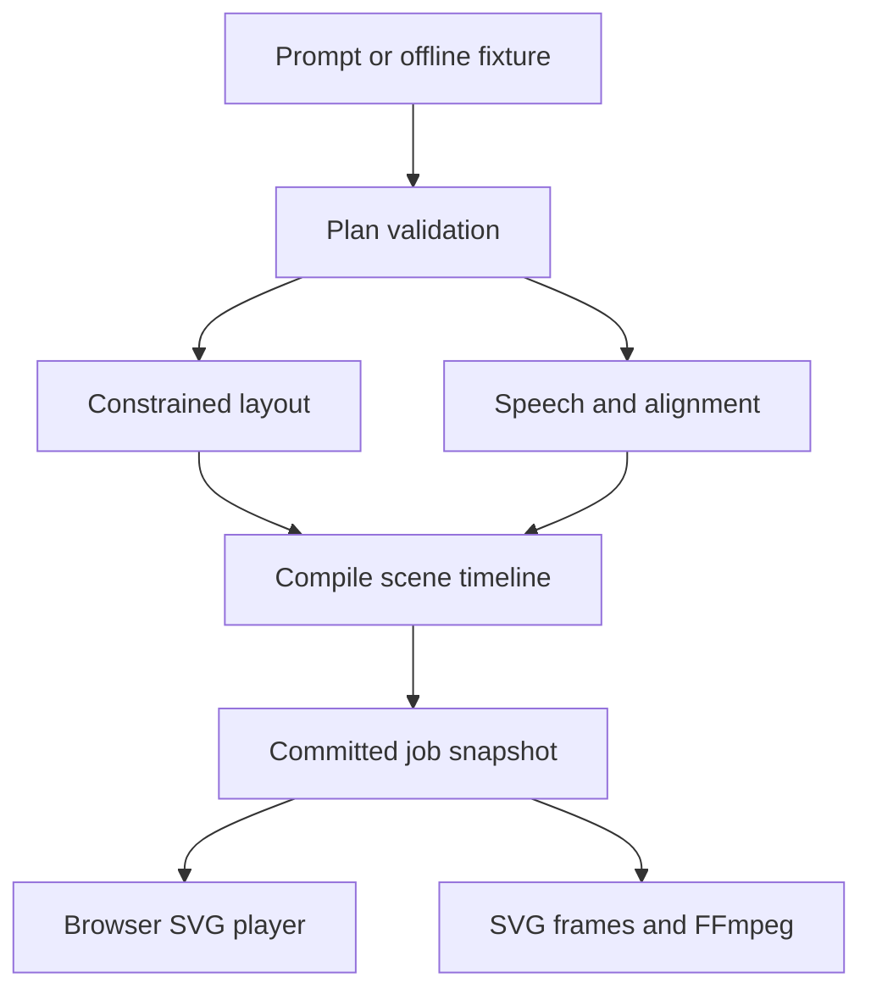

# Experimental semantic V2 — 2026-09-12

`src/v2/` is a parallel semantic pipeline following `../../v4_docs/`. It separates
teaching claims/concepts/beats from visual inventory, trusted assets, deterministic
composition, narration freeze and speech-aligned actions. The canonical V2 renderer is
`src/v2/renderer/render-svg.ts`; browser and export import the same pure function.
No generated executable code, raw SVG, or model coordinates are accepted.

`VISUAL_PIPELINE=v1|v2` defaults to V1 and selects the landing UI. V2 currently has
`GET /api/v2/golden` and `POST /api/v2/compile`, plus a real-model CLI. The legacy job
API retains its V1 schema. All ordered Phase 14 archetypes compile: structural/convergence,
transformation/comparison, cross-section/spatial-process, numbered steps, flow, cycle,
equation_walkthrough, matrix_operation, hierarchy, timeline and trajectory. Flow uses dependency
ranks; cycles follow a closed semantic loop; equation lines stack monotonically; matrix terms read
left to right; hierarchy is a validated single-root tree; timeline is declared order on a rail;
trajectory is ordered steps on a descending path. Other archetypes and advanced motions fail
explicitly. A metered vision critic (`src/v2/vision-judge.ts`) is calibrated by
`src/v2/calibration.ts` against nine known corruptions in both orders
(`npm run calibrate:v2:critic`); it is optional and not yet an automatic repair trigger.
See [V4_IMPLEMENTATION.md](V4_IMPLEMENTATION.md) for live status and boundaries.

---

# Current architecture note — 2026-09-09 review

This document contains historical design sections. Current code already has seven layouts, a separate director, optional critic, 12 illustration kinds, up-to-five concurrent chapter preparation, local voice-engine speech and batched raster export. Statements below about three layouts, purely sequential preparation and deferred repair are historical, not the current module contract.

Current representation remains Plan v1 with nodes/edges: visualIntent is metadata, not an event program. Exact two-scene chapter schemas, heuristic text metrics, kind-based colors, fixed arrow delays and a narrow final-thumbnail critic remain constraints. Alignment quality is under investigation: saved WAVs contain substantial signal after the final word timestamp. Preserve provider error visibility; do not infer a silent-success fallback from old notes.

For observed implementation gaps see [VIDEO_QUALITY_REVIEW.md](VIDEO_QUALITY_REVIEW.md). For proposed V2 contracts, stage ownership, migration and gates see [OPTIMIZATION_PLAN.md](OPTIMIZATION_PLAN.md). The proposed architecture has not been implemented. Pure rendering and immutable committed geometry remain the central constraints.

---

# Architecture and decisions

## Data-driven rendering

The model emits an explanation plan. A whitelist validator accepts only known fields. A compiler resolves a small set of semantic layouts into geometry, connects node boundaries and schedules reveals against word positions. A pure SVG renderer reconstructs any frame from `(compiledScene, timeMs)`.

The whiteboard is implemented with inline SVG in v0.1, not an HTML Canvas 2D surface. Both are viable implementations of the user's canvas concept. SVG was selected here so the browser and offline rasterizer consume the exact same graphical representation. This avoids maintaining two renderers before the hypothesis is established.

## Module map (current, 2026-09-11)

| Module | Responsibility |
|---|---|
| `src/planner.ts` | Outline → chapter content (with deterministic heals) → visual director/auto-director; validators, repair loops, model router. |
| `src/auto-director.ts` | Deterministic layout/kind composition for composable scenes (skips the director LLM call). **Debt:** kind guessing is a keyword-regex table that must become model-driven (see HANDOFF). |
| `src/model-router.ts` | Per-task model selection: `MODEL_ROUTER` JSON > per-task env > base model. |
| `src/budgets.ts` | Input/retrieval/output/cost/latency budgets per stage. |
| `src/sources.ts` | Ingest: PDF (`pdftotext -raw`, page-aware), docx/pptx/md/json/text/URL. |
| `src/document-map.ts` | Hierarchical section map (heading detection, extractive summaries, sha256 cache). |
| `src/retrieval.ts` | Structural chunking + BM25, optional RRF hybrid; tiny-source pass-through. |
| `src/embeddings.ts` | Key-gated embedding index (fail-soft; BM25-only fallback). |
| `src/figures.ts` | poppler figure/table detection, crops, bounded-parallel fail-soft VLM description. |
| `src/engine.ts` | Whitelist validation, layouts, compile, pure SVG rendering, playback clamp, text metrics. |
| `src/jobs.ts` | Single-process async preparation, atomic JSON snapshots, bounded concurrency, progressive availability, cancellation. |
| `src/voice-engine-client.ts` / `src/v2/speech.ts` | Async boundary to the external local voice-engine (Supertonic 3 default, Piper fallback); engine timing explicitly marked estimated. |
| `src/server.ts` | Loopback HTTP app, job API, local media and static files. |
| `public/app.ts` | Polling, play/pause/seek, audio clock, transcript, metrics, source intake (prompt/URL/PDF). |
| `scripts/export.ts` / `src/scene-output.ts` | Frame rendering via SVG/Sharp, FFmpeg encode+mux, per-scene artifacts. |
| `src/logger.ts` | Console + `app.log` + per-job `log.jsonl`; secret redaction. |
| `src/progression.ts` | Progression frames + static-interval/connector lints. |

**Current pipeline:** ingest → page-aware text → document map (cached) → outline (map-routed)
→ per-chapter content (+ deterministic heals) → director or auto-director → per-scene TTS
(speculative, overlapped) + compile → render/export. All model output is validated scene
data; the renderer is deterministic and shared by browser and export.

## Plan versus compiled scene

The plan holds `version`, `title`, and scenes. Each scene has `id`, `title`, `narration`, `layout`, nodes with labels and zero-based whitespace word indices, connectors and an optional note. The model cannot inject executable source, URLs, arbitrary SVG or style attributes.

Compilation produces node rectangles, line endpoints, draw durations, resolved times and word alignment. Logical size is 1280×720; the browser scales the viewBox and export rasterizes at a selected resolution. Aspect-ratio reflow is not implemented.

Geometry is fixed for a committed scene. Revealing a later node never reflows an already visible node. Connectors start after both endpoint nodes have appeared. A 650 ms scene tail protects the final event from immediate replacement.

## Timing and audio

Offline mode estimates 145 words/minute. It is silent, displays the narration as timed text and marks timing as estimated. It does not claim speech synthesis.

With keys, the speech provider returns MP3 bytes and character timestamps. The adapter verifies source text agreement and maps characters to indexed words. Normalization mismatches fail visibly rather than silently drifting. The player uses the audio clock while speech is active, and advances through the scene tail afterward. Browser autoplay, seek and pause behavior still require live browser QA.

The MP4 exporter uses the same time-based renderer. Narrated exports pad/trim each scene's audio to its compiled duration before concatenation. Export the original job JSON beside its MP3 files; a downloaded JSON alone does not contain audio bytes.

## Progressive delivery

Job states: queued → planning → preparing → complete, with error/cancelled alternatives. A restarted server reports a persisted unfinished job as interrupted. It preserves prepared scenes but does not resume an interrupted model request.

The browser polls full snapshots every 400 ms. Each snapshot has a revision and bounded sequence of events. Full snapshots make read reconnection simple and idempotent. Scene preparation is sequential in a background async task; browser playback proceeds independently. There is no HLS, SSE, multi-process queue, or scene-parallel generation in v0.1.

User-selected delay is injected per scene to exercise buffering. It must not be counted as actual model generation speed. During starvation the clock clamps to prepared duration. Completion and buffering are distinct states.

## Local runtime boundary

Use Node 22+ and TypeScript; npm run build emits ESM modules into dist. The server binds to loopback, limits two active jobs, denies cross-origin writes, caps request size, and serves only explicit source modules and local public/media paths.

This is not a production multi-user service. Job snapshots remain in memory after completion and are retained on disk. Add retention, authentication and a real worker process only when needed for deployment. Provider output validation establishes structural safety, not factual correctness.

## Explicitly deferred

- Fine-tuning and any foundation-model training.
- Arbitrary generated code or Manim execution.
- Automatic model repair loops and scene-parallel generation.
- Pixel-accurate text measurement, multilingual font packaging, advanced routing.
- HLS, persistent distributed queues and automatic restart recovery.
- External image assets, background music, PDF extraction and source citation verification.
- Production latency/cost claims and open-domain quality claims.

## Narration (updated 2026-09-12 — external local voice-engine)

Narration is provider-independent. `src/voice-engine-client.ts` is the async
boundary to the separate local `voice-engine` project at
`../lamina-labs-video/voice-engine` (JSON stdin/stdout, one process per request):
Supertonic 3 is the default for its 31 languages, Piper is the fallback for
everything else, and Nepali is always Piper. `src/v2/speech.ts` adapts the same
boundary for the V2 pipeline. The engine owns language routing, voices and
providers; the main repo never imports a speech provider directly.

Local engines return audio duration, not word timings, so the boundary builds
word timings from duration and marks them `engine` — rendered as
`LOCAL TTS · ESTIMATED WORD TIMING`, never as provider alignment. Speech
failures degrade to explicitly estimated silent timing (logged, counted in
`fallbackCount`/`degradedScenes`); they are never hidden. ElevenLabs and Kokoro
were both removed from this repository on 2026-09-12 per user request; only the
local Supertonic 3 / Piper engine remains.

Browser media is the master clock during speech, with a separate visual tail.
Seeking resets audio identity; seeking into the tail does not replay narration.
A generation counter ignores stale play-promise updates. Preparation events
are persisted in snapshots and shown in the UI. `/?job=UUID` opens a saved job.

### Provider default history

2026-09-08: omitted `ttsProvider` selected ElevenLabs (voice-quality feedback
at the time). 2026-09-09: omitted `ttsProvider` now selects **Kokoro** — free,
local, no key, and the reliability problem (see above) is fixed. ElevenLabs
requires explicit `--tts elevenlabs`. Speech failures preserve the provider
HTTP status/code/message; library-plan restrictions must not be labeled as
exhausted quota. The UI default matches the API. 2026-09-12: Kokoro removed from
this repository at the user's request; local narration now goes through the
external `voice-engine` (Supertonic 3 / Piper). ElevenLabs was then removed too,
so the only narration providers are Supertonic 3 and Piper.
