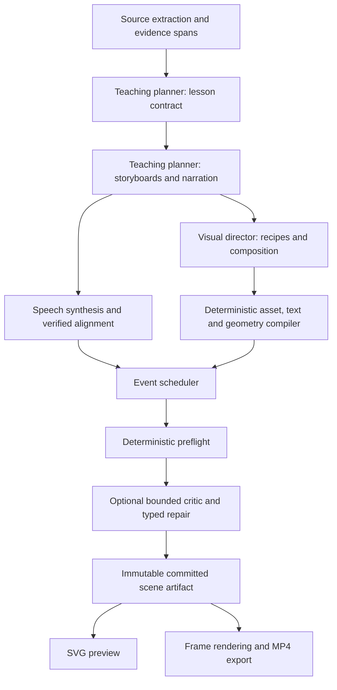

# Architecture and visual quality roadmap

**Updated:** 2026-09-09, after reviewing five additional videos across their full timelines.
**Status:** Proposed implementation plan; none of the tasks below is claimed implemented.
**Evidence:** [VIDEO_QUALITY_REVIEW.md](VIDEO_QUALITY_REVIEW.md).

This replaces the earlier priority ordering in this file. Historical Phase 0–12 work remains in `tasks.md`, HANDOFF and RESULTS. Their “complete” labels do not establish reference-level teaching quality.

## 1. Outcome and scope

Produce explainers in which the important mechanism is understandable from the board, with narration directing attention to visible changes. Independently approach the observable clarity of the supplied Lamina reference. Keep the working application, validated model data and deterministic SVG approach; migrate incrementally.

Start with DNA, a bicycle pump, and attention. They test structured scientific parts, physical mechanisms, and repeated objects/numeric relationships. A bespoke DNA fixture is an expressiveness test, not proof of open-domain generation quality.

Keep models away from arbitrary executable code/SVG/shaders. Asset builders are reviewed application code. No Manim migration, agent-framework rewrite, cloud deployment, billing system, or foundation-model training is needed. Preserve old jobs and MP4s; do not overwrite reference material.

**Closer** means measured improvement over our frozen baseline in mechanism coverage, legibility, alignment and teaching continuity without factual regression. **Domain parity** needs matched-prompt human evaluation in a stated domain. **Broad parity** needs held-out topics, longer sources, languages, latency, cost and reliability evidence. Current evidence supports a plausible route toward parity, not a percentage or promised date.

## 2. Keep the foundation; change the representation

| Retain | Upgrade |
|---|---|
| Ingestion and model budgets | Evidence spans and claim-to-source links |
| Outline/content/direction stages | Shared lesson contract and event storyboard |
| Node IDs and kinds | Global concepts, repeated instances, named parts and roles |
| Seven layouts and vector assets | Composable mechanism/diagram recipes |
| Speech adapter | Verified audio-word alignment and event-span anchors |
| Pure SVG renderer | Compiled paths, text, dependencies and pencil schedule |
| Background preparation and ordered commit | Prioritized bounded workers and reliable speculative-work metrics |
| Optional thumbnail critic | Bounded semantic/composition review with explicit disposition |
| Shared rendering for export | Persisted compiled artifacts with font/asset/compiler provenance |

Correctness comes before decoration. Teacher catchphrases, detailed icons and a background grid cannot compensate for missing mechanisms or inaccurate word timings. More model calls cannot express actions that the schema forbids.

## 3. Proposed architecture and stage ownership



Use two intelligent **roles**, not two total API calls: teaching planner and visual director. Critic is an optional third role. At B storyboard batches, C critic calls and R repairs, budget approximately `1 + 2B + C + R` calls initially; record actual retries/tokens. No agents for arrows, fill, fonts, icons or pencil placement.

### Teaching planner

The global `LessonContract` fixes audience, prerequisites, objectives, claim/evidence references, concept definitions, introduction order, duration budget and running example. Establish the concept registry before concurrent direction. Each scene has one objective, incoming knowledge, what visibly changes, and the expected takeaway.

Storyboards contain semantic beats plus narration segments. Beats describe explanatory actions: show, compare, separate, connect, trace, extend, count, substitute, highlight or conclude. They reference claims and concepts. Text-only beats may be appropriate, but cannot satisfy a mandatory mechanism-coverage requirement.

Assign source spans by relevance and prerequisites rather than equal paragraph slices. Start with deterministic indexed spans and matching; evaluate retrieval before adding a model role. Do not let a source's embedded instructions alter task policy.

### Visual director

Resolve each beat into a known recipe, parameters, parts, groups and action sequence. It may expand a concept into repeated instances or a multi-part illustration, without inventing claims. Supply a lesson-relevant catalog subset and authored examples rather than an undifferentiated list of icons.

Do not emit raw coordinates or change final narration silently. Return `unsupportedVisual` when capability is missing; try a supported compositional recipe, then explicitly report a symbolic fallback if necessary. A server rack must not masquerade as a satellite just to avoid a generic-kind count.

### Deterministic compiler and scheduler

Resolve actual font bounds, illustration geometry, composition constraints, semantic ports, connectors and layer order before commitment. Bind outline/fill/label/highlight events to verified narration spans. Rendering reads the artifact and time only.

Stable geometry means no accidental reflow. Initially show transformations by revealing prepared before/after states or subparts. Later component motion, if added, must use a precompiled trajectory and swept bounds within an immutable scene envelope; never relayout during playback.

### Critic and repairs

Input: objective, claims/evidence, narration segments, beat mapping, and readable key frames at the first meaningful state, main operation and result. A final thumbnail alone cannot establish timing quality.

Return typed issues (`asset_missing`, `mechanism_missing`, `composition`, `text`, `timing`, `factual`, `continuity`), target IDs and severity. Geometry errors go to deterministic repair; visual choices to the director; factual/script changes to one bounded planner revision before speech commitment. Persist `passed`, `repaired`, `needsReview`, `unavailable` or `failed`. At most one repair cycle per scene initially. Never relabel unreviewed output as passed.

## 4. Data contracts

These are proposed fields, not currently supported APIs. Use versioned discriminated unions and bounded JSON schemas.

| Contract | Information | Invariant |
|---|---|---|
| `LessonContract` | Audience, target duration, objectives, claims, registry, scene order, running example | Shared/frozen before concurrent direction |
| `Concept` | `conceptId`, canonical term, definition, semantic type, visual role, style token | Identity is independent of icon kind |
| `Claim` | Text, evidence-span IDs or explicit general-knowledge status, review status | Lexical matching does not prove truth |
| `StoryboardScene` | Objective, prerequisites, instances, narration segments, beats, completion state | Variable scene count; one main objective |
| `Beat` | Claim IDs, meaning, narration segment, required visual outcome | Mechanism maps to graphical action |
| `VisualInstance` | `instanceId`, `conceptId`, asset/recipe, parameters, parts, ports | Repeated objects may share visual type |
| `Composition` | Groups, directions, ordering, alignment, attachment and gaps | One compiler owns coordinates |
| `VisualAction` | Action, target part IDs, beat, dependencies, span anchor, offsets | No unknown IDs, dependency cycles or code |
| `CompiledSceneV2` | Measured text, paths/length tables, bounds, events, timing, version hashes | Immutable and seekable |
| `GenerationManifest` | Source/prompt/schema/model/provider/font/asset/compiler versions, spans, costs, warnings | Output can be attributed and replayed |

Example semantic mapping (illustrative syntax):

```json
{
  "beatId": "open_fork",
  "claimIds": ["helicase_separates_strands"],
  "narrationSegmentId": "n2",
  "requiredVisualOutcome": "two separated template arms",
  "actions": [
    {"kind": "revealPart", "target": "dna_fork.left_template", "anchor": "n2:separates"},
    {"kind": "revealPart", "target": "dna_fork.right_template", "anchor": "n2:separates"},
    {"kind": "highlight", "target": "dna_fork.opening", "anchor": "n2:fork"}
  ]
}
```

Implement anchors as validated segment/token IDs and occurrence/ranges, not first-match strings. Map final narration segments to TTS words and provider tokens. Log approximate fallback as degraded evidence.

Separate concept (polymerase), instance (polymerase on one strand) and asset (enzyme marker). Preserve useful identities such as old/new strands and query/key/value. Do not force every positive result to green. Add redundant labels/patterns where color carries meaning.

## 5. Ordered implementation backlog

All tasks are pending. Effort is relative: small = local fix, medium = subsystem, large = integrated change; not a calendar promise. Each batch must have independent validation and a reviewable result. Do not commit unless requested.

### Phase A — Baseline correctness

**Dependency:** none. **Effort:** medium. **Exit:** trustworthy baseline before timing/polish claims.

| ID | Work and code area | Acceptance |
|---|---|---|
| A1 | Trace alignment in `scripts/kokoro_tts.py` and `src/kokoro-speech.ts`: actual filtered token IDs, G2P, punctuation, BOS/EOS, chunks, predictor recomputation. Prefer timing from the synthesis path; otherwise evaluate forced alignment of final audio. | Listening/independent alignment checks at beginning/middle/end on all 32 audited WAV scenes. Classify/fix active audio after the last word timestamp. No truncation or global stretch disguised as a fix. |
| A2 | Fix caption gap/tail state and measured phrase wrapping in `src/engine.ts`. | Opening words never reappear in a gap/tail; short-gap hold, long-gap hide; at most two measured lines; deterministic seek. |
| A3 | Respect numeric fill opacity; inspect all final palette/highlight composites. | 0/.25/1 opacity honored; fault text readable; normal text meets the chosen 4.5:1 contrast gate. |
| A4 | Replace unique-kind and forced shape-diversity gates with identity/role checks; count perceptual groups. | Token rows, multiple keys and repeated bases pass; invalid IDs and misleading inconsistent identity still fail. |
| A5 | Parameterize director schema by expected scene IDs/count; validate duplicate/extra IDs and explicit false/unset repair changes. | One-scene repair uses one-scene schema; two-scene batching still works; mocks enforce the schema. |
| A6 | Capture export/job/config provenance and a fixed review corpus. | Reports distinguish historical MP4, current-render replay and fresh planner generation; exact versions/hashes recorded. |

Add alignment regression audio with repeated terms, punctuation, numbers, pauses and multi-chunk speech. Word-count and WAV-duration equality alone cannot pass A1. Use existing media first, preserve baselines, and avoid an uncontrolled regeneration campaign.

### Phase B — Prove expressive visuals without a model

**Dependencies:** A3/A4; design can overlap A1 investigation. **Effort:** large.

| ID | Work | Acceptance |
|---|---|---|
| B1 | V2 unions/schema and legacy adapter in `src/types.ts` / `src/schema.ts` | V1 jobs remain readable; unknown actions/parameters rejected; no arbitrary code/SVG |
| B2 | Proposed `src/assets/registry.ts` and `src/diagrams/` with semantic parts, ports, bounds, action support, parameter limits and provenance/license | Deterministic asset expansion; missing parts fail before playback |
| B3 | DNA fork/paired strands/fragments, pump cylinder/piston/valves, attention tokens/query-key/value weighting | Start/intermediate/result states teach the mechanism; knowledgeable reviewer approves relationships |
| B4 | Bounded repeat/sequence/grid/bracket/bar/axis/counter primitives | Six tokens, repeated keys and base pairs do not require unrelated glyphs or artificial variety |

Create 2–3 candidate compositions for each pilot and select for clarity. Use consistent strokes, restrained fills, readable labels and a dominant mechanism drawing. A richer illustration is a useful arrangement of parts, not more decorative detail. Label all hand-authored demonstrations as fixtures.

### Phase C — Geometry, typography and drawing events

**Dependencies:** B1/B2; use B3 fixtures. **Effort:** large.

| ID | Work | Acceptance |
|---|---|---|
| C1 | Actual shaping/measurement with packaged licensed fonts; persist line/run geometry | Uppercase, long terms, mixed numbers and selected Devanagari samples fit; preview/export line breaks agree; unsupported scripts explicit |
| C2 | Group/region and recipe-specific layout constraints; honor annotation preference/semantic owner | Safe title/subtitle regions; stable geometry; no silent first-node attachment or shrink-to-hide crowding |
| C3 | Shape/part ports, obstacle-aware connector routing and label footprint reservation | No connector through text; no attachment to empty icon bounds; impossible layout requests a split |
| C4 | Canonical paths, arc-length tables, fill/label events, dependencies and pencil ownership | Proposed ≤2 logical-pixel pencil-to-stroke endpoint error; no pencil for non-draw fades |
| C5 | Preflight of actual text, shape containment, contrast, connectors and semantic key frames | Zero unclassified hard violations on fixture stress corpus; intended contacts explicitly permitted |

Keep logical 1280×720 initially. Asynchronous preparation/font loading can coexist with a synchronous pure renderer. Prototype the measurement backend before committing to a library; do not maintain unrelated browser and export wrapping heuristics. Use glyph outlines only if exact platform fidelity justifies their size/accessibility tradeoffs.

Use arc length for both reveal and pencil. Cache geometry during compilation; do not recompute curve samples every frame. [SVG paths](https://www.w3.org/TR/SVG2/paths.html) provide the underlying primitives, not a complete teaching/layout engine.

### Phase D — Teach the planner/director the new representation

**Dependencies:** expressive fixtures from B/C; verified timing before alignment claims. **Effort:** large.

| ID | Work | Acceptance |
|---|---|---|
| D1 | Global lesson contract, concept registry, claim/evidence spans and prerequisites | Definitions precede use; shared style/identity bindings across batches |
| D2 | Variable scene storyboard and narration segments; remove two-scenes-per-chapter and `minutes * 2` assumptions | Scene boundaries follow objective/topology; variable progress and export work |
| D3 | Director emits recipe parameters, instances, groups, constraints and action mapping | Fork/range intersection/piston are matching geometry; unsupported visuals reported |
| D4 | Beat coverage checks that reference visible actions/states, with quantity units/context | A box labeled “three spheres” cannot satisfy required intersection visualization |
| D5 | Incoming/outgoing scene summaries and frozen concept registry | Old/new strands and query/key/value maintain identity across full lessons |

Prefer direct explanation, a coherent running example and attention cues tied to actual changes. Do not require analogies/misconceptions in every scene. Remove prompt contradictions around universal variety and repeated identity. Keep stable instructions/catalog schema versioned and separate from dynamic source data for caching.

Use the current catalog-verified configured model as the baseline. Later compare models with the same schema, assets, inputs and retry caps; do not choose a larger model to compensate for an inexpressive contract.

### Phase E — Real speech and pacing

**Dependencies:** A1/A2, C4, D2. **Effort:** medium/large.

- Add proposed `src/timeline.ts` for segment/occurrence anchors, dependency constraints, anticipation/lag and reading holds. Relationship arrows anchor to relationship phrases rather than endpoint start +700 ms.
- Let complex illustrations start before their labels; tune 100–250 ms anticipation only where useful. Validate against real speech.
- Resolve simultaneous actions explicitly: simultaneous reveal without a misleading single pencil, or a planned sequence. Array iteration order must not determine teaching attention.
- Measure first meaningful visual, no-change intervals, scene durations and unsupported beats. Long holds need explanation, not automatic decorative motion.
- Derive timing from verified audio and actual visual work. Propose ±10% duration tolerance for 1/5-minute modes initially; revise narration before commitment if materially off. Never pad silence or distort speech to meet a target.
- Transition after a completed concept; optionally reuse an identity/diagram context. Never relayout an already committed scene.

**Acceptance:** proposed median absolute event-to-reviewed-phrase error ≤150 ms and p95 ≤350 ms after intentional documented offsets; no unexplained chapter drift. Review at least 30 anchor samples distributed across each five-minute pilot. These are targets, not achieved measurements.

### Phase F — Bounded quality review

**Dependencies:** A5, C5, D/E. **Effort:** medium.

- Critic sees readable semantic key frames, objective, narration, claims and beat mappings. Final 640×360 thumbnails alone are insufficient for subtle text/timing defects.
- Route issues by type. Revalidate repairs. Narration revisions invalidate speech/timing; visual-only repairs must leave narration unchanged. Never mutate committed scenes.
- Persist review/repair disposition and exact diff. Severe unresolved issues fail the quality gate or mark `needsReview`; unavailable critic is never `passed`.
- Initially at most one critique and one bounded repair per scene. Expose remaining limitations rather than generating indefinitely.

**Acceptance:** same-output critic-on/off ablation shows benefit worth latency/cost and false-positive changes. Add schema-enforcing repair tests. Enable default critique only after this evidence, not because the stage exists.

### Phase G — Optimize the measured critical path

**Dependencies:** instrumentation A6; accept quality tradeoffs only after D–F. **Effort:** medium.

| Work | Boundary | Measure |
|---|---|---|
| Prioritize next playable scene | `jobs.ts` / `concurrency.ts`: bounded lookahead, scene 1 priority | Cold/warm first-playable p50/p95 and buffering |
| Bound speculative speech | Shared cancel-aware queue before dispatch; reserve characters before synthesis; hash script/voice/version | Queue depth, discarded work, actual service time |
| Correct telemetry | Distinct queued/start/end/await/commit spans for all stages | Full export completion; do not sum parallel spans |
| Cache immutable artifacts | Exact script+voice/model for audio; schema/font/asset/compiler for geometry | Hit rate and invalidation correctness |
| Batch direction experimentally | Compare single-scene and small compatible batches without delaying scene 1 | Cost, repairs, quality, first playable |
| Export profiles | Low-cost preview and explicit 1080p/30 final; profile raster/PNG/encoder backpressure | Render/mux time, CPU, peak RAM, bytes |
| Preserve compiled artifacts | Export committed V2 scenes; explicit legacy V1 recompile mode | Preview/export identity across code updates |

Chapter concurrency, speculative TTS, prompt caching and parallel raster batches already exist. Refine them. Current speculative calls bypass the later scene semaphore/character reservation, and `ttsMsByScene` measures residual await time. Audit Python thread safety before increasing TTS concurrency; more concurrent HTTP calls do not prove more inference throughput.

Initial proposed targets on declared hardware: one-minute warm first-playable p95 ≤15 s, full 1080p/30 export p95 ≤60 s. Measure the new five-minute workload before setting its SLO; the old blanket <120 s was not derived from these richer scenes. Report delivered minutes, all paid calls, export cost and local compute separately. Quality gates take precedence.

### Phase H — Generalize and evaluate parity

**Dependencies:** D–G. **Effort:** iterative.

Use the target document's 20 topics: attention, transformer, RAG, agent tool calling; HTTP, indexing, load balancing, event queue; photosynthesis, neuron, water cycle, DNA; derivative, probability, matrix multiplication, gradient descent; refrigerator, GPS, bank transfer, supply chain. Add pump, tectonics and printing regressions.

Separate development and held-out prompts. Fix audience/source/duration. Start with the three pilots and at least three generations per prompt to expose variance, then expand within a declared budget. Record first attempts and repaired results with exact denominators.

Ablations:

1. Frozen current baseline.
2. Same plan/narration with correctness fixes, isolating renderer effects.
3. Authored semantic fixtures, establishing expressive ceiling (not model output).
4. Generated semantic storyboard/recipes with critic off.
5. The same outputs with bounded critic repair.
6. Later model alternatives under identical assets/schema/budgets.

Competitor comparison requires matched prompts/reference outputs within authorized access/budget. The supplied attention clip cannot rank all topics. Use two independent reviewers, anonymized randomized order, and preserve disagreements/critical failures. Include a small learner-comprehension check when feasible; attractive graphics and understanding are different outcomes.

## 6. Quality gates

All thresholds below are initial proposals, not existing results or universal rules.

| Dimension | Gate | Method |
|---|---|---|
| Factual integrity | Zero critical factual errors in accepted pilots | Knowledgeable source/claim review |
| Mechanism coverage | Every mandatory mechanism beat has an appropriate visible operation | Beat → action → part/state audit plus human judgment |
| Readability | No essential clipped/overlapping text; readable at 640×360 | Actual bounds and rendered inspection |
| Contrast | Normal text 4.5:1; qualifying large text 3:1 | Final composited colors including highlights |
| Geometry | Zero unclassified hard bounds/collision/connector errors | Preflight at event key frames |
| Identity | Agreed concept identity across scenes | Registry validation and human review |
| Alignment | Median ≤150 ms; p95 ≤350 ms after intentional offsets | Listening/independent alignment across timeline |
| Pacing | No unexplained >8 s idle interval in pilot mechanisms | Schedule diagnostic and approved holds |
| Human quality | Median ≥4/5 for clarity, visual meaning, composition, alignment, polish | Two reviewers; separate dimensions |
| Reliability | ≥90% first-pass usable pilot results | Exact denominator, variance and failures retained |
| Determinism | Artifact + time yields same frame; preview/export agree | Random seek and frame comparison |

Contrast targets use [WCAG text contrast criteria](https://www.w3.org/TR/WCAG22/#contrast-minimum); meeting them alone is not full accessibility compliance. Do not game gates by adding decorative objects, shrinking type, hiding hard prompts, or claiming a label demonstrates a mechanism.

## 7. Concrete five-minute DNA design brief

Approximate planning budgets, not fixed timers. Scientific claims need subject review; reconcile the final script with verified audio. Sections can split/merge.

| Section | Objective | Required visible teaching |
|---|---|---|
| 0:00–0:25 | Why copy | Parent DNA and daughter outcomes; old/new legend |
| 0:25–0:55 | Complementary templates | Paired strands with A–T/C–G examples |
| 0:55–1:25 | Open a fork | Y-shaped arms and helicase at opening |
| 1:25–2:00 | Synthesis direction | Polymerase, 5′/3′ orientation and matching bases |
| 2:00–2:40 | Leading versus lagging | Same fork, continuous growth versus fragments |
| 2:40–3:10 | Join fragments | Gaps, required processing and ligation; avoid conflating enzymes |
| 3:10–3:45 | Proofreading | A mismatch and explicit correction |
| 3:45–4:15 | Remaining errors | A persistent sequence change with qualified consequences |
| 4:15–4:40 | Coordinated mechanism | Same identities in the integrated view |
| 4:40–5:00 | Semiconservative result | Two duplexes, each one old and one new strand; comprehension prompt |

Do not invent new glyphs for “polymerase backing up” and “proofreading result.” They are actions/states of related components. This brief is an architectural acceptance fixture, not a request to hardcode every future video.

## 8. Asset strategy and generalization

Build a small grammar, then domain packs prioritized by frequency × teaching impact:

- Grammar: repeat, paired paths, sequence, grid, bracket, labeled regions, bar/axis, counter, comparison and prepared before/after states.
- Pilot science/mechanics: DNA fork, base pair, enzyme marker, cylinder, piston, valves and air particles.
- Computing: tokens, vectors/matrices, weighted values, queue, packet, service and database operations.
- Regression expansion: plate cross-section, letter blocks/press/paper and satellite/range intersection.

Each asset needs semantic parts, ports, bounds, draw order, sample states, parameter constraints, styles and license/provenance. Consistent vector icons can support a lesson but cannot replace its diagrams. Generated raster illustrations remain optional; they cannot silently satisfy requirements for editable parts or accurate labels.

Log unsupported visual requests and use them to prioritize assets. Collect accepted storyboards, scene data, repairs and human ratings. Evaluate distillation/fine-tuning only after quality stabilizes and a model bottleneck is measured.

## 9. Migration and implementation handoff

One renderer entry point dispatches by compiled version. Keep V1 behavior while V2 pilots run behind an explicit option. Do not silently reinterpret saved scenes or replace MP4s. Promote V2 only after gates pass; any legacy/symbolic fallback is visible.

| Area | Existing/proposed files |
|---|---|
| Identity/storyboard | `src/types.ts`, `src/schema.ts`, proposed `src/storyboard.ts` |
| Prompts/repair/coverage | `src/planner.ts`, `src/prompt-builder.ts`; relevant existing `skills/` when implementing |
| Assets/recipes | `src/icons.ts`, `src/illustrations.ts`, `src/vocabulary.ts`, proposed `src/assets/`, `src/diagrams/` |
| Geometry/text/routes | `src/engine.ts`, `src/style.ts`, proposed focused compiler modules |
| Timing | `scripts/kokoro_tts.py`, `src/kokoro-speech.ts`, proposed `src/timeline.ts` |
| Jobs/export | `src/jobs.ts`, `src/concurrency.ts`, `scripts/export.ts`, `scripts/generate-video.ts` |
| UI | `public/app.ts`: variable scene count, review status, V2 artifact consumption |
| Verification | Existing engine/generation/teaching/speech tests; proposed audio and semantic visual corpus |

Before each code batch run `npm test` (includes build). Add tests for real failures rather than mirrored implementation. After changes run the full suite and phase-specific visual/audio checks. Use one-minute pilots before five-minute matrices. Paid generation must use a bounded recorded experiment budget; fixtures/mocks cannot establish provider throughput or human quality. Do not commit or push unless requested.

### First batch to execute

1. Capture reproducible alignment cases from DNA scene 1 and the reviewed pump: audio, token mapping, word boundaries, model/library versions.
2. Implement A2 captions and A3 opacity with regression tests and before/after frames.
3. Implement A4 repeated-instance validation and A5 one-scene repair schema, retaining invalid-ID rejection.
4. Complete A1 diagnosis/fix or mark alignment explicitly unverified; do not claim timing quality until independently checked.
5. Implement B1–B3 for one authored DNA fork, then pump and attention. Review before enabling model generation of V2.
6. Update HANDOFF and RESULTS with exact checks, remaining failures and next task ID.

Start with A1–A5, not a new agent framework or uncontrolled generation matrix. This document completes the planning request; implementation remains pending.
