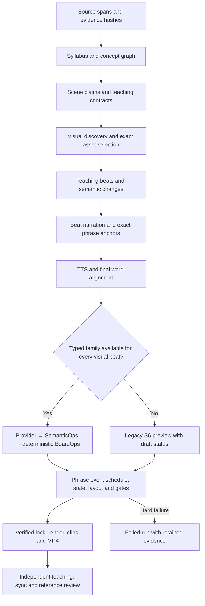

# V2b architecture, output and integrity audit — 2026-10-07

Scope: worktree `hypothesis_claude/.claude/worktrees/v2b`, branch `teaching-compiler-v2`, starting HEAD `16bdad3556d44439e0b1e2a8b5784882a583308a`. Source inspection, independent reviewer and architecture-agent audits, retained source-generated lesson records, and sampled scenes. This is an audit of this prototype, not Lamina's internal implementation. Historical artifacts are preserved.

## Verdict

The project is not ready to lock on benchmarks or claim Simi parity. The intended compiler architecture is sensible, but implemented representation coverage and observed outputs remain incomplete. Five retained V2 videos are drafts. No source-generated MP4 has yet demonstrated the newly connected icon/typed-provider code. The two fresh public-source October 7 attempts also failed before TTS and MP4 export. Offline contract tests do not establish visual teaching quality.

My engineering judgment is **4/10 overall against the promised product**: useful evidence, compiler and replay infrastructure exists, but the user-visible outcome and broad mechanism coverage are not delivered. This is an assessment, not a calibrated benchmark score. Simi generation speed is unknown; local reference media cannot establish it.

## Why the videos are generic

1. The gallery predates the completed visual discovery/icon integration. All five historical V2 scorecards report zero pictorial entities.
2. Nineteen representation families are selectable, but only `state_transition` has an active typed provider. If one visual beat needs an unavailable family, the entire mixed scene uses legacy model-authored S6 BoardOps preview. Weighted graphs, circuits, waves and material flow are not implemented typed providers.
3. S6 asks for mechanisms, yet a failed plan/repair can fall back to a concept-only board. Fallback adds or highlights labels and is explicitly draft-only. That can preserve an MP4 while losing the explanation the speaker gives.
4. Before this continuation, selected depictions reached execution but did not reach beat-mode planning/narration. That missing handoff is now fixed; fresh output is still needed.
5. The audited historical execution turns events into sentence cues, so actions cluster near sentence starts. The implementation committed as `2f4794c` now schedules typed event groups from their final aligned phrase clocks and checks the derivation against audio alignment. Legacy previews retain sentence cues; live alignment/quality acceptance is still missing.

Concrete scene evidence:

| Generated scene | Spoken/required meaning | Actual board | Consequence |
|---|---|---|---|
| Dijkstra, `01-module_1_relax_neighbours` | “Add the edge weight to get each neighbour's candidate”; candidate = starting distance + edge weight | Three fallback highlights on Nearest-node selection, Tentative distances and Distance relaxation | No weighted edge or candidate computation is shown |
| Mitosis, `01-module_1_separate_chromatids` | Chromatids move to opposite poles; visual invariant requests two moving groups | Fallback highlights Mitosis/Metaphase and adds an Anaphase label | No chromatid movement or separation is shown |

The Dijkstra speech beat is 4.00–6.30s into its scene (captions 37.900–40.200s overall); highlights run about 3.85–4.85s. Mitosis speech is 3.16–6.52s into its scene; label actions run about 3.01–4.31s. These examples demonstrate clock proximity without semantic alignment. The scene files and failure traces are retained under `.data/benchmark-v2/cold-v2/2026-10-04-final2-{dijkstra,mitosis}`; gallery copies are under `benchmark-review-2026-10-03/results`.

The sampled Simi photosynthesis scene progressively builds a recognizable leaf, chloroplast, sun, energy symbol and reaction vessel with arrows. Our sampled Dijkstra/mitosis scenes show mostly colored labeled boxes. This is a style comparison across different topics. The reference topic map permits matched comparison for photosynthesis/Simi and attention/Lamina only. No parity score is justified by these old topics.

## Pipeline phase by phase

| Phase | What happens and who owns it | Determinism / current limitation |
|---|---|---|
| S1 intake | Code parses files/URLs, retains spans, source identities/hashes and optional RAG evidence | Pinned source projection is replayable; URL content and retrieval can change before pinning |
| S1b syllabus | A model selects concepts, chapters/modules, learning objective and duration budgets; code validates source support and budgets | Cold model output is not guaranteed identical |
| S2 concept graph | Model emits canonical concepts, semantic kinds and directed relations with evidence | Schemas/grounding checks are deterministic; extraction itself is not |
| S3 teaching contracts | Model chooses scene claims, teaching order, learner change and semantic visual intents; code validates graph/source identity | Repairs may be needed; conservative identity checks are not general entailment |
| S3b visual discovery | Offline catalog retrieval plus depiction proposer/judge select exact icons, reviewed structures or honest labels per scene | Exact resolution is deterministic once selected; model selection/vision judging is not |
| Beat planning | Model emits learner states, entities, reveal order, semantic changes, dependencies and representation family | Stable IDs/validation are code-owned; only one family has a typed execution provider |
| S4 narration | Beat-local model calls realize canonical claims and emit exact phrase anchors | Exact phrase/identity/word-budget checks fail closed; they do not independently prove teaching quality |
| S5 speech | Local or ElevenLabs TTS produces measured audio, then word alignment; bounded duration fitting may rewrite and resynthesize | Provider/audio output is not guaranteed repeatable cold; pinned audio is replayable |
| Representation dispatch | Supported state-transition scenes compile through provider → SemanticOps → BoardOps; mixed/unsupported scenes use draft legacy preview | Typed replay/lowering is deterministic; legacy S6 planning is model-dependent |
| Board/state | Shared reducer applies operations and preserves declared board identity across scenes | Deterministic for pinned operations; broader learner/semantic continuity is incomplete |
| Layout | Code measures text, allocates regions, routes edges, checks collisions/readability | Deterministic for pinned fonts/assets/configuration; gate failures remain failures |
| Timeline | Typed event groups use final aligned phrase clocks, lead time, dependency/concurrency and reserved pauses; legacy preview uses sentence cues | Deterministic implementation; fresh generated-video alignment and independent meaning-based QA remain unmeasured |
| Lock/replay | Code pins context, audio, operations, assets, geometry, tool/source digest and representative render samples | Tamper-evident hashes and deterministic replay, not a signed provenance certificate |
| Render/export | Seeded SVG rendering, bounded raster workers and encoding produce scenes/clips/MP4/captions | Pinned SVG/sample replay is checked; cold provider generation is outside this guarantee |
| Evaluation | Automatic gates, scorecard/certification and review-bundle tooling expose failure/draft states | Full independent G1–G12 semantic QA, human review and benchmark acceptance remain open |

**Is it completely deterministic? No.** The downstream compiler/render replay is deterministic for pinned source/model/audio/assets/tool inputs. Fresh source retrieval, model planning, TTS, alignment/provider transport are not guaranteed to reproduce identical bytes. A warm cached replay and a cold end-to-end generation are different experiments. No claim of Lamina's internal determinism follows from its visible videos.

## Results and speed

All five retained videos are approximately 60s, H.264 1920×1080 with AAC audio. All are `draft`, `releaseCandidate:false`, `pictorialEntities:0`.

| Historical V2 topic | First encoded clip | Request to completion | State-changing op share |
|---|---:|---:|---:|
| Compound interest | 149.6s | 226.4s | 15.4% |
| Dijkstra | 175.6s | 251.1s | 28.6% |
| Doppler effect | 114.4s | 180.9s | 25.0% |
| Mitosis | 242.5s | 334.4s | 8.8% |
| Ohm series circuit | 152.5s | 224.2s | 4.8% |

Median completion is 226.4s (~3.8 minutes) for one minute of output, across these old trials. The range is 3.0–5.6 minutes, roughly 3.0–5.6 times output duration. These runs used different historical pipeline digests and cannot measure current code or establish competitor speed. First encoded clip is not first audible playback; actual first-audible player latency remains unmeasured.

October 6 diagnostic evidence:

- `v2b-semantic-icons-2026-10-06/mitosis-t1`: failed during preparation/beat narration after 223.4s and $0.023460349 measured model spend. S1–S3 completed; beat stage made 27 calls with 14 repairs (~90.5s). Failures included claim semantics/identity, exact phrase anchors and excessive recap wording. No MP4.
- `v2b-atomic-relations-2026-10-06/mitosis-t1`: syllabus transport/preflight failure after 30.1s, zero provider completion and zero measured spend. No MP4.

## Code/architecture alignment and work completed

The implementation follows the intended separation of validated model data from deterministic execution. Models do not emit executable graphics code or own coordinates/timestamps. Exact selected-icon rendering and replay are enforced. Semantic IDs, evidence bindings, persistent board state, source digests, failure/draft status and bundle verification exist.

Recent completed contracts include source/claim semantics, canonical identities, teaching beats and learner/dependency schemas, phrase-anchor locking, structural lesson hierarchy/checkpoints, typed introduction/transformation/separation, deterministic merge and causal-edge lowering, required selected-icon rendering, and conservative claim-bound visual coverage.

This continuation finishes the provider/beat merge integration, fixes same-beat event order and prompt contradictions, bounds mechanism descriptions, propagates shared depiction vocabulary to beat/S4 prompts and cache identity, and closes the reviewer-found ordinary-verifier provider-version downgrade. Additive regression tests cover these contracts. None of those changes is a live visual acceptance pass.

I found no installed/project skill named “AI Agent Architect.” An architecture agent was used to inspect the actual implementation. The invoked review-agent skill requires direct, read-only, defect-first review; independent review was also requested explicitly by the user. Relevant active prompts are the beat planner, beat narration, depiction proposer/judge, and BoardOps planner. The repository's older prompt-builder skill points to a missing `src/prompt-builder.ts`; the V1 scene-director string is not the beat-mode V2 architecture.

## Were tests or benchmarks tampered with?

No tracked frozen benchmark source, golden hash, expected media or scorecard was altered in this continuation. The current diff adds meaningful merge/vocabulary/provenance regressions and updates expected provider v3→v4 identity. Independent review found no deleted tests or weakened assertions. Frozen-set verification reports `benchmark intact`.

This is bounded evidence, not certification of the whole project history. Current benchmark change inventories are relative to the recorded Git HEAD. They are not anchored to an independently approved test baseline. Baseline verification also discloses missing G-10/G-DOC/G-LONG, 40 pruned scratch entries that cannot be verified and four external entries skipped. An MP4, test pass, rehashed lock or draft scorecard cannot be promoted into benchmark success.

## Why prolonged fixing has not delivered the promise

The work has made validation and reproducibility stronger while product-critical visual coverage remains incomplete. That sequencing has produced many passing contracts without a current end-to-end visual success. Model repair churn, conservative semantics checks, unsupported-family dispatch and generic fallback are observable causes. Some hard failures are valid protection against unsupported claims; others require improving data contracts/prompts or compiler coverage. Lowering gates would hide the problem. The immediate acceptance evidence must be a new source-generated video inspected with its audio, scene records and failed gates visible.

## Remaining work, in execution order

1. Produce a fresh current-code public-source photosynthesis diagnostic; retain stage timing, model IDs, costs, repairs, selected/rendered icons, draft/failure flags and MP4. Review against tagged Simi scenes with the same topic.
2. Implement typed causal/material-flow and mixed-family composition, then weighted graph, quantity/plot, wave and circuit mechanisms. Do not force all ideas into state_transition merely to stay on the typed path.
3. Measure the tested phrase-event scheduler and v11 lock replay in a fresh generated video. Typed groups use final aligned intervals; infeasible events block encoding. Broader event rules and independent alignment calibration remain open.
4. Prove each spoken mechanism visually, with independent evidence/narration/representation/mechanism/sync/layout/muted-comprehension QA. Icons alone are not mechanism coverage. Set acceptance thresholds through reviewed benchmark evidence.
5. Improve generation latency after semantic correctness is demonstrated: reduce repair churn, use appropriate stage routing, progressively publish verified scenes and measure actual first-audible playback.
6. Finish cross-scene learner/entity state continuity, the context-provider snapshot interface, long-lesson acceptance and typed family fallbacks.
7. Establish an independently approved test inventory; run the one-digest 5×3 cold matrix and untouched heldout set; collect required human alignment, muted-board and rights reviews. Only then consider a version lock.

Implementation and tests are separate from `passed` quality. The authoritative full 15-phase backlog remains `docs/HANDOFF.md`; this report does not create a second roadmap.

## Verification and fresh diagnostic

Final commands, commit identity and any new run are appended after execution. Fresh runs are kept under `.data/`; the untracked historical gallery is preserved and excluded from commits.

Final verification before source generation: `pnpm run typecheck:hypothesis` passed; `pnpm run test:hypothesis` passed with local loopback permission: 1,453/1,453 Node tests, 2/2 retained-board audit tests, 28/28 alignment Python tests and 12/12 RAG Python tests. `git diff --check` passed. Independent re-review found no remaining introduced defect in the bounded merge/vocabulary/provenance changes. Raster-only legacy replay retains a digest-only provenance limitation and is not a signed certification.

Public-source diagnostic after commit `ba5115b`: [OpenStax Biology 2e, overview of photosynthesis](https://openstax.org/books/biology-2e/pages/8-1-overview-of-photosynthesis), cold cache, Luna content/beat/S6 models, local TTS requested, $0.10 cap. Run `2026-10-06T18-56-47-237Z-a9e16a7c-0a19-463d-bfb2-8ca7099f584d` failed during preparation after 158.6s with 4 hard failures and $0.016631313 measured model spend. Syllabus, concepts, teaching plan and depiction selection completed. Beat/narration made 19 calls and 10 repairs. No speech, BoardOps or MP4 was produced. Trace and summary remain under `.data/hypothesis-runs/claude/public-diagnostics`; this is a failed diagnostic, not a benchmark pass.

Observed blockers: family/operation pairs absent from prompt guidance; long entity states; attempts to repair a claim/entity mismatch by changing the canonical concept behind a persistent identity; non-exact/overlapping phrase anchors; and whole-sentence polarity checking of a positive assertion with an added negative qualification. The second prompt slice exposes existing qualifier/identity requirements, registered operation pairs and text limits; preserves source-backed physical referents upstream; and versions cache identities. No validation threshold, source input, expected output or baseline was weakened. Live efficacy remains unmeasured until another fresh run.

Follow-up review found gaps missed by the provider-only merge tests: the lock demanded an impossible shared merge before-state and an extra introduction for created results, and the board validator demanded that a consumed cross-concept input remain visible after merging. Full runner/lock synthetic regressions now cover valid merge/separation, exact declared consumption, and rejection of infeasible final phrase clocks. The fixes preserve the input's required visible entity immediately before the declared operation. They do not waive visibility for an ordinary removal.

The phrase scheduler now has compiler-owned event-to-BoardOp groups, hard reserved-pause deadlines, and v11/v4 replay. The verifier checks scene beat/sentence/phrase intervals against the final narration and aligned words, not just against a self-consistent scene schedule. A coherent rehashed clock/schedule tamper is rejected. Late typed events block lock publication and encoding. Legacy previews retain their prior sentence-cue behavior. Focused scheduler/runner/compiler tests passed 57/57; full merge/separation/board-validation tests passed 33/33. Current full-suite verification and a new generated-video acceptance run are still required.

Test changes are explicit: new regressions were added; version assertions changed with v11/v4; an old-lock lifecycle test now actually pins its pre-v11 schemas and also asserts that a new v11 lock cannot omit lifecycle data. A newly written prompt assertion used the wrong semantic-field name and was corrected to the existing schema; no product validator changed for that correction. Frozen benchmark inputs and expected media remain untouched.

Final follow-up verification: typecheck and the full project suite passed, **1,464/1,464 Node + 2/2 retained-board audit + 28/28 alignment Python + 12/12 RAG Python**. The first attempt caught a missing-field legacy audit regression; it was fixed by retaining no consumption exemption for older beats. Independent review found no further introduced defect. Frozen benchmark verification remains intact. An earlier automatic approval-review usage failure prevented one execution; the same approval path later succeeded after available usage was confirmed. The current-code video and Simi acceptance claims are still unmeasured.

Fresh cold diagnostic under commit `2f4794c`: run `2026-10-07T10-09-26-107Z-8169f502-0b77-4c9c-a397-fc8277673e2b` failed in preparation after **141.5s** with **one hard failure** and **$0.022164299** measured model spend. S2 retained carbon dioxide, water, sugar molecules and oxygen as entities; five scene plans and depiction selection completed. The combined beat/narration stage made **25 calls, 11 repairs, 76.3s**. All scenes except the recap completed their beat narration. The recap introduced its process before its ordered input anchors; repair was limited to the anchor phrase, then invented phrases absent from the sentence. No TTS, BoardOps or MP4 was produced. This identifies a narrow repair-field dependency bug; it is not a quality or speed pass, and two stochastic cold plans are not a controlled efficacy comparison.

The architecture follow-up also confirms that adding a provider file alone is insufficient: execution and lock replay currently dispatch state_transition directly. The next family implementation must use the registry in both paths. Existing `cause` lowering handles only exact `causes` edges; `flow` only updates abstract location and has no renderer lowering. A typed material-transfer relation, event-to-relation binding and matching coverage proof are needed before input/process/output diagrams can qualify as mechanisms. Static arrows alone do not establish dynamic teaching quality.

The recap repair dependency is now implemented and tested: same-sentence anchor conflicts can repair their sentence and related phrases together; a wrong nomination can repair its exact sentenceIndex. The generator now retains complete failing pointers, rejecting changes to valid sibling sentences. Canonical meaning and copied-phrase/order validation remain enforced after every patch. Full verification passed **1,466/1,466 Node + 2/2 audit + 28/28 alignment + 12/12 RAG**, with independent review finding no confirmed introduced regression. Fresh output under this repair version remains the next acceptance check.
